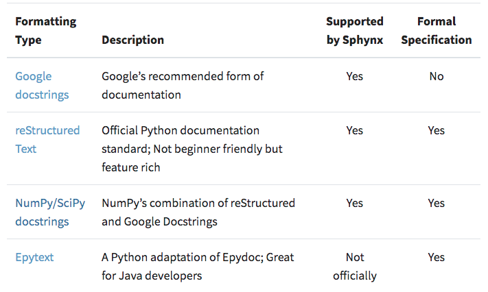

# Documentando código de Python usando Sphinx

En este tutorial vamos a aprender a documentar nuestro código de Python usando
un framework llamado _Sphinx_. Para esto, hay algunos prerrequisitos que vamos a
cubrir rápidamente, estos son los _docstrings_ de python y un formato de texto
_markup_ llamado reStructuredText.

Para hacernos una idea de lo que queremos lograr al final de este tutorial
podemos ver la [documentación de scrapy][11] y su [código fuente][12]. También
queremos lograr algo similar a la [documentación del objeto ``numpy.ndarray``][13].

## _Docstrings_ de Python

---

La documentación de Python se hace principalmente en unas cadenas de texto
llamadas _docstring_. Estas se ubican justo luego de las declaraciones de las
funciones, clases, métodos, variables, etc., o justo al inicio de los módulos
de Python.

El siguiente bloque de código es un ejemplo de un módulo de Python con
docstrings.

```python
"""Docstring explaining this module."""
import math

def my_function(a, b, c):
    """This is a docstring explaining my_function."""
    return a + b + c * math.pi
  
class my_class:
    """Docstring for ``my_class``."""
    d = 1
    """This is a docstring for ``self.a``"""
    def my_method(self, e, f):
      """Docstring explaining ``my_method``."""
      return self.d + e + f
```

El objetivo de los _docstrings_ es explicar clara y concisamente el código,
para que las personas que lo leen o que deben mantenerlo puedan entenderlo
rápidamente. Hay que tener presente cuando leemos docstrings –y comentarios del
código en general– que éstos "pueden mentir" y el código es el que tiene la
última palabra.

Obviamente, la idea al escribir los _docstrings_ es que se entienda mejor el
objetivo del programa, pero a veces lo que esto hace es confundirnos más. Por
eso hay que tener mucho cuidado al escribir la documentación y una regla general
que está en las guías de Python es que "menos es más" –refiriéndose a que no
hay que documentar el código con detalle excesivo, ya que una explicación
complicada puede terminar confundiendo al desarrollador.

En últimas, lo que queremos con los _docstrings_ que escribimos es que _Sphinx_
los entienda y logre renderizar apropiadamente un archivo en formato HTML o PDF
que sea agradable de leer. Para que esto suceda debemos escribir nuestros
docstrings en uno de los formatos que _Sphinx_ entiende: Google, NumPy/SciPy,
reStructuredText o Epytext. Acá veremos brevemente un ejemplo de estos formatos.



*Tabla y ejemplos a continuación tomados de [Real Python: Documenting Python Code: A Complete Guide][1].

### Google docstrings

```python
"""Gets and prints the spreadsheet's header columns

Args:
    file_loc (str): The file location of the spreadsheet
    print_cols (bool): A flag used to print the columns to the console
        (default is False)

Returns:
    list: a list of strings representing the header columns
"""
```

### Numpy/Scipy docstrings

Esta es una combinación de los Google docstrings y reStructuredText (que
veremos a continuación).

```python
"""Gets and prints the spreadsheet's header columns

Parameters
----------
file_loc : str
    The file location of the spreadsheet
print_cols : bool, optional
    A flag used to print the columns to the console (default is False)

Returns
-------
list
    a list of strings representing the header columns
"""
```

### Epytext

```python
"""Gets and prints the spreadsheet's header columns

@type file_loc: str
@param file_loc: The file location of the spreadsheet
@type print_cols: bool
@param print_cols: A flag used to print the columns to the console
    (default is False)
@rtype: list
@returns: a list of strings representing the header columns
"""
```

## reStructuredText (reST)

---

Más que un formato de _docstring_, reST es un lenguaje markup que fue diseñado
para escribir la documentación de python, pero que gracias a su versatilidad
ahora se usa para documentar también otros lenguajes o para construir sitios
web simples.

A continuación una lista de sitios que nos ayudarán a comprender la sintaxis de
reST y cómo usar este formato adecuadamente:

* [Docutils reStructuredText][2]
* [An Introduction to reStructuredText][4]
* [reStructuredText Cheat Sheet][3]

Un docstring para una función en formato reST luce así:

```python
"""Gets and prints the spreadsheet's header columns

:param file_loc: The file location of the spreadsheet
:type file_loc: str
:param print_cols: A flag used to print the columns to the console
    (default is False)
:type print_cols: bool
:returns: a list of strings representing the header columns
:rtype: list
"""
```

## Uniendo todo: Sphinx

---

Sphinx es un _framework_ que nos ayudará a construir la
documentación de nuestros proyectos de Python. Este programa lo que hace es
transformar archivos reST en archivos HTML o pdf, dándoles un formato más
amigable gracias al uso intero de _templates_.

Si escribimos bien los docstrings de Python, Sphinx
nos mostrará la información escrita en los docstrings en un
formato más amigable y legible. Además, Sphinx permite añadir muchos plugins o
extensiones que, de acuerdo con lo que necesitemos, nos ayudarán a tener una
mejor documentación.

Antes de configurar Sphinx con un proyecto de Python es importante que la
estructura jerárquica de nuestros archivos sea similar a la siguiente:

```bash
root_project/
│
├── project/  # Project source code
├── docs/
├── README
├── HOW_TO_CONTRIBUTE
├── CODE_OF_CONDUCT
└── examples.py
```

En la mayoría de ocasiones el directorio ``root_project`` contiene otro
directorio, ``project`` en el cual está todo el código. Además, contiene
también el directorio ``docs`` que es en el que vamos a almacenar nuestros
archivos reST y los HTML y PDFs que se generan apartir de los reST.

### Instalación

Para instalar Sphinx podemos escribir en la terminal

```bash
$ pip install -U sphinx
```

Para otros métodos de instalación ver la [documentación de Sphinx][8].

### Sphinx Qickstart

Sphinx tiene un comando que nos ayudará a generear la estructura básica de
archivos reST, los cuales podremos modificar a nuestro gusto.

Para comenzar, suponiendo que estamos en el directorio ``root_project``, nos
cambiamos al directorio ``docs``

```bash
$ cd docs
```

desde allí ejecutamos el comando

```bash
$ sphinx-quickstart
```

Acá nos aparecerá una sesión interactiva con preguntas acerca de nuestro
proyecto (las preguntas comienzan con el símbolo ``>``).

```none
Welcome to the Sphinx 3.2.1 quickstart utility.

Please enter values for the following settings (just press Enter to
accept a default value, if one is given in brackets).

Selected root path: .

You have two options for placing the build directory for Sphinx output.
Either, you use a directory "_build" within the root path, or you separate
"source" and "build" directories within the root path.
> Separate source and build directories (y/n) [n]: y

The project name will occur in several places in the built documentation.
> Project name: My documented python package
> Author name(s): FEn-FiSDi
> Project release []: 1

If the documents are to be written in a language other than English,
you can select a language here by its language code. Sphinx will then
translate text that it generates into that language.

For a list of supported codes, see
https://www.sphinx-doc.org/en/master/usage/configuration.html#confval-language.
> Project language [en]: <click enter>

Creating file ~/root_project/docs/source/conf.py.
Creating file ~/root_project/docs/source/index.rst.
Creating file ~/root_project/docs/Makefile.
Creating file ~/root_project/docs/make.bat.

Finished: An initial directory structure has been created.

You should now populate your master file /some_path/root_project/docs/source/index.rst and create other documentation
source files. Use the Makefile to build the docs, like so:
   $ make builder
where "builder" is one of the supported builders, e.g. html, latex or linkcheck.
```

Como nos indica la sesión interactiva, este comando crea algunos archivos
necesarios para generar nuestra documentación con Sphinx.

Ahora la estructura de directorios debe lucir algo así:

```none
root_project/
├── project/  # Project source code
└── docs/
    ├── Makefile
    ├── build
    ├── make.bat
    └── source
        ├── _static
        ├── _templates
        ├── conf.py
        └── index.rst
```

Como vemos, el comando ``sphinx-quickstart`` crea los directorios
``~/root_project/docs/source/`` y ``~/root_project/docs/build/`` en los cuales
se almacenan los archivos fuente y los archivos renderizados (HTML, PDF),
respectivamente. Además, crea los archivos ``~/root_project/docs/Makefile`` y
``~/root_project/docs/makefile.bat``.

El archivo ``~/root_project/docs/Makefile`` se usa implícitamente para generar
la documentación a partir de ``~/root_project/docs/source/index.rst``.

Por otro lado, el archivo ``~/root_project/docs/source/index.rst`` es el
archivo fuente de nuestra documentación, es el equivalente a el archivo
index.html de un sitio web.

Si pensamos en la documetnación que estamos generando como un diagrama de árbol,
la idea es que ``index.rst`` esté en la raíz y toda la documentación que
escribimos estará debajo de éste en el diagrama. Ésta jerarquía está
completamente definida por la directríz ``.. toctree::`` de reST. En este
momento si abrimos el archivo ``index.rst`` vemos que tiene incorporada esta
directríz, pero no tiene ningún archivo asociado:

```restructuredtext
.. My documented python package documentation master file, created by
   sphinx-quickstart on Tue Oct 13 18:45:47 2020.
   You can adapt this file completely to your liking, but it should at least
   contain the root `toctree` directive.

Welcome to My documented python package's documentation!
========================================================

.. toctree::
   :maxdepth: 2
   :caption: Contents:


Indices and tables
==================

* :ref:`genindex`
* :ref:`modindex`
* :ref:`search`
```

La estructura de árbol de la documentación es la siguiente

```none
index.rst
│
└── Contents:
```

En la siguientes sección poblaremos este toctree con la documentación del
código.

Por su parte, el archivo ``conf.py`` contiene todas las configuraciones
necesarias para que Sphinx renderice los HTML y PDFs tal y como nosotros
queremos.

### Configuraciones Básicas

La primera configuración que debemos realizar es actualizar el absolute path
para que Sphinx encuentre nuestro proyecto y sea capaz de leer los docstrings
escritos en nuestro código. Para ello debemos insertar estas líneas de código
justo al principio del archivo ``conf.py``

```python
import os
import sys

sys.path.insert(0, os.path.abspath('../../'))
```

En ``conf.py`` también podemos configurar las extensiones disponibles, que se
pueden consultar en [este sitio][9]. En nuestro caso hay dos extensiones que
son importantes y debemos usar:

* ``sphinx.ext.autodoc``: nos permitirá crear la documentación
  automáticamente a partir de los docstrings que escribimos en nuestro código
* ``sphinx.ext.napoleon``: permitirá que Sphinx entienda docstrings en formato  
  Google o NumPy/SciPy (recordemos que Sphinx está basado en reST y ese es el formato de docstring que entiende por defecto)

Para añadir extensiónes a Sphinx, buscamos en ``conf.py`` la lista llamada
``extensions`` y la llenamos con las extensiones que deseemos

```python
extensions = [
    'sphinx.ext.autodoc',
    'sphinx.ext.napoleon',
    'sphinx.ext.viewcode',
    'sphinx_rtd_theme',
]
```

En este caso hemos usado dos extensiones más de las que mencionamos
anteriormente:

* ``sphinx.ext.viewcode``: la usamos en caso que queramos que el código se
  incluya en la documentación.

* ``sphinx_rtd_theme``: nos permite usar unos templates de HTML que provee
  [Read the Docs][10] para que el sitio web de la documentación luzca mejor.
  Para poder usar esta extensión debemos instalarla primero:
  
  ```bash
  $ pip install sphinx_rtd_theme
  ```
  
  luego importarla en ``conf.py``:

  ```python
  import sphinx_rtd_theme
  ```

  luego añadir la extensión a la lista ``extensions`` (ya lo hicimos), y
  finalmente configurar el tema en la variable ``html_theme`` de ``conf.py``:

  ```python
  html_theme =  "sphinx_rtd_theme"
  ```

En este punto hemos creado la base y el código fuente de la página de inicio
de nuestra documentación (en index.rst), pero aún no hemos añadido docstrings del código contenido en ``~/root_project/project/``. Antes de continuar
añadiremos un código con docstrings a este directorio para que Sphinx cree la documentación.

La estructura de directorios luego de añadir el código es la siguiente

```none
root_project
├── docs
│   ├── Makefile
│   ├── build
│   ├── make.bat
│   └── source
│       ├── _static
│       ├── _templates
│       ├── conf.py
│       └── index.rst
└── project
    ├── __init__.py
    ├── my_subpackage
    │   ├── __init__.py
    │   └── numpy_docstring_example.py
    └── numpy_docstring_example.py
```

El archivo ``numpy_docstring_example.py`` lo tomamos de la [documentación
oficial de NumPy].

Ahora estamos listos para usar la extensión ``sphinx-autodoc`` y luego
renderizar nuestro sitio HTML con la documentación generada a partir de
docstrings (con soporte para formatos Google y NumPy/SciPy), con un tema HTML
amigable e incluyendo el código fuente en el sitio web.

### Documentando nuestro código a partir de docstrings usando ``sphinx-autodoc``

Ahora queremos que Sphinx incluya los docstrings –que escribimos en nuestro
código– como parte de la documentación. Para esto nos ubicamos en el directorio
``~/root_project/docs`` y ejecutamos el comando

```none
$ sphinx-apidoc -o ./source ../project
```

En nuestro caso, el código estaba ubicado en el directorio
``~/root_project/project`` y por eso usamos ``../project`` como segundo
argumento del comando, pero en cada caso se debe remplazar ``project`` por el
nombre del directorio que tenga el código fuente con los docstrings.

Justo luego de ejecutar el comando, la estructura de directorios luce de la siguiente manera

```none
root_project
├── docs
│   ├── Makefile
│   ├── build
│   ├── make.bat
│   └── source
│       ├── _static
│       ├── _templates
│       ├── conf.py
│       ├── index.rst
│       ├── modules.rst
│       ├── project.my_subpackage.rst
│       └── project.rst
└── project
    ├── __init__.py
    ├── my_subpackage
    │   ├── __init__.py
    │   └── numpy_docstring_example.py
    └── numpy_docstring_example.py
```

Como notamos, este comando lo que hace es crear un archivo reST por cada paquete o
subbaquete que contenga el código. En este punto es bueno aclarar que el código
ubicado en ``~/root_project/project/`` debe estar organizado como un paquete
de Python, con archivos ``__init__.py`` ubicados apropiadamente en el paquete
principal y en los subpaquetes. Además, el comando crea un archivo llamado
``modules.rst`` que debemos incluir en el ``toctree`` que deseemos. En nuestro
el archivo index.rst luce así

```restructuredtext
.. My documented python package documentation master file, created by
   sphinx-quickstart on Tue Oct 13 18:45:47 2020.
   You can adapt this file completely to your liking, but it should at least
   contain the root `toctree` directive.

Welcome to My documented python package's documentation!
========================================================

.. toctree::
   :maxdepth: 2
   :caption: Contents:

   modules

Indices and tables
==================

* :ref:`genindex`
* :ref:`modindex`
* :ref:`search`

```

Nótese que ya incluimos el archivo ``modules.rst`` en el ``toctree``.

De esata forma se incluirá la documentación de los docstrings cuando
rendericemos el HTML o el PDF.

Los archivos generados automáticamente por ``sphinx-autodoc`` se pueden
modificar a la medida de nuestras necesidades, para así obtener la
documentación e incluir lo que queramos, donde queramos.

### Renderizando el HTML y el PDF

El último paso para obtener la documentación (en el formato que deseemos) es la
renderización. Para esto nos ubicamos en el directorio ``~/root_project/docs/``
y ejecutamos el comando

```bash
$ make HTML
```

o, si preferimos un documento PDF,

```bash
$ make latexpdf LATEXMKOPTS="-silent"
```

La opción ``LATEXMKOPTS="-silent"`` hace que no se imprima en la terminal toda
la información durande el proceso de compilación de LaTeX. Si deseamos ver todo
el log que imprime LaTeX, simplemente se debe ejecutar ``$ make latexpdf``.

Suponiendo que ejecutamos el renderizado de HTML, la estructura de archivos de
la documentación debió quedar similar a la siguiente:

```none
root_project/
│
├── docs/
│   ├── build/
│   │    │
│   │    ⋮
│   │    └── html/
│   │        │
│   │        ⋮
│   │        ├── genindex.html
│   │        ├── index.html
│   │        ├── modules.html
│   │        ├── objects.inv
│   │        ├── project.html
│   │        ├── project.my_subpackage.html
│   │        ├── py-modindex.html
│   │        ├── search.html
│   │        └── searchindex.js
│   ├── Makefile
│   ├── make.bat
│   └── source
│       ├── _static
│       ├── _templates
│       ├── conf.py
│       ├── index.rst
│       ├── modules.rst
│       ├── project.my_subpackage.rst
│       └── project.rst
└── project
    ├── __init__.py
    ├── my_subpackage
    │   ├── __init__.py
    │   └── numpy_docstring_example.py
    └── numpy_docstring_example.py
```

Ya hemos finlaizado el proceso base que nos permite ver nuestra documentación
como un sitio web. Si estamos ubicados en ``~/root_project/docs/``, para
visualizar el HTML solo debemos abrirlo:

```bash
$ open ./build/html/index.html
```

## Recap

En este tutorial revisamos:

* cómo se construyen docstrings de Pyhton,
* diferentes tipos de docstrings de Python,
* una brevísima introducción de reStructuredText,
* cómo estructurar un proyecto de python con documentación,
* cómo configurar Sphinx para que lea nuestros docstrings y documente
  automáticamente nuestro proyecto.

Esto es lo básico para comenzar a documentar formalmente nuestros proyectos de
Python, pero las posibilidades de personalización son muchas y la práctica es
la que nos permite apoderarnos de este tipo de herramientas.

Para practicar, podemos crear nuestro propio paquete de python, que tenga uno o
dos subpaquetes y varios módulos dentro de cada uno de ellos, escribir los
docstrings de las funciones y las clases y generar la documentación con Sphinx.
Para practicar esto no es necesario que el código sea funcional –pero si lo es,
mucho mejor!

## Referencias

---

1. [Real Python: Documenting Python Code: A Complete Guide][1]
2. [Google docstrings style guide][6]
3. [numpydoc docstring guide][7]
4. [Docutils reStructuredText][2]
5. [An Introduction to reStructuredText][4]
6. [reStructuredText Cheat Sheet][3]
7. [Sphinx][5]

[1]: https://realpython.com/documenting-python-code/
[2]: https://docutils.sourceforge.io/rst.html
[3]: https://docutils.sourceforge.io/docs/user/rst/cheatsheet.txt
[4]: https://docutils.sourceforge.io/docs/ref/rst/introduction.html
[5]: https://www.sphinx-doc.org/en/master/
[6]: https://github.com/google/styleguide/blob/gh-pages/pyguide.md#38-comments-and-docstrings
[7]: https://numpydoc.readthedocs.io/en/latest/format.html
[8]: https://www.sphinx-doc.org/en/2.0/usage/installation.html
[9]: https://www.sphinx-doc.org/en/master/usage/extensions/index.html#extensions
[10]: https://readthedocs.com/
[11]: https://docs.scrapy.org/en/latest/index.html
[12]: https://github.com/scrapy/scrapy/tree/master/docs
[13]: https://numpy.org/doc/stable/reference/generated/numpy.ndarray.html#numpy-ndarray
[14]: https://numpy.org/doc/stable/docs/howto_document.html#example
